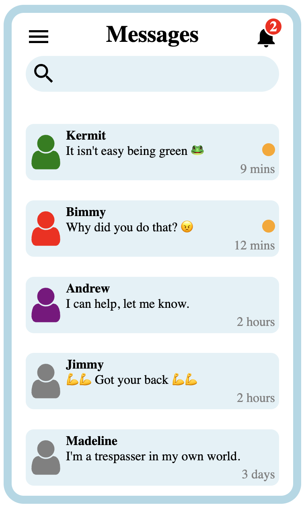

# Intro to React

---

## So you're learning react...

Before learning any technology, it's worth asking questions:

examples:

- What is this technology?

- Why should I learn it?

- What problems does it solve?

- What does it simplify?

---

## What is react?

- React was released in 2013

- React is an _open-source project_ built and maintained by **Facebook**.

- React is a javaScript **library**<sup>1</sup> for building **user interfaces**<sup>2</sup>.

<sup>1</sup> Put simply, a **library** is a collection of code.

<sup>2</sup> In our context, a **user interface** (UI) is what a person sees when they interact with your website/application.

---

## React is extremely popular!

[npm trends downloads](https://npmtrends.com/angular-vs-react-vs-vue)

- This means there is a large community working to help improve react.

- It also means there are many tutorials on how to use react.

- As well as many stack overflow conversations you can find on google to help debug issues.

---

## Why do I need react?

With your newly acquired skills, you can build a complicated UI using vanilla js, HTML and css.

However, as the services of a website increase, the code gets more complicated.

Soon, you're swimming in spaghetti ( a tangled codebase ).

It can also be very complicated to keep the DOM updated...

---

## Why do I need react?

Imagine your webpage offers a chat service.

A user logs in and the webpage gets a feed of some conversations they are having.

Maybe an example conversation looks like this:

```js
const conversation1 = {
	user1: "Kevin",
	user2: "Mary",
	messages: [
		{
			sender: "user1",
			time: "Wed Jul 28 2023 10:24:12 GMT-0400",
			message: "Hey 😊",
			read: false
		}
		// and many more
	]
}

```

---

## Why do I need react?

So you build a bunch of js functions that fire off and build out what looks like a conversation in the DOM.

But your webpage keeps track of many conversations at once...

```js
const converations = [
	conversation1,
	conversation2,
	...
]
```

All this data is **front-end state**

It all needs representation in the DOM so the user can see it and interact with it.

---

## Why do I need react?

Using js and DOM manipulation, you build this *complicated* UI



*By modern standards this isn't a particularly complicated UI - but with your experience, you know how much work this is in js*

---

## Why do I need react?

But then the server tells your front end that there is an update...

You need to keep the user informed of these changes:


---

## Why do I need react?

Managing this transition would be very difficult.

In fact it would probably be easier to wipe the DOM clean and rebuild it (not a performant solution).

But this is where react steps in.

---

## What problem does react solve?

React automatically updates the DOM when state changes.

It manages this through the execution of MANY javaScript functions.

Remember that react is a library.

These functions are already built for you.

This saves you a TON of time, on every page, on every service.

---

## What problem does react solve?

Performance-wise, react is very efficient at keeping the DOM updated when state changes. *(You will see this in action on day 5 of react)*

React also reduces reload time by making fewer requests to a server during site navigation. *(You will see this in action on day 4 of react)*

---

## What does it simplify?

React environments also keep your code organized.

React is driven by **components**.

A **component** is a function that produces a small portion of the UI.

Each **component** is (usually) its own file.

So react uses many **components** instead of a single, massive `scripts.js` file.

This means you don't have to go fishing through thousands of lines of code in one file (presuming you're building your components properly ^^ )

More on **components** soon!

---

[topic-2-starting-a-react-application](./topic-2-starting-a-react-application.md)
