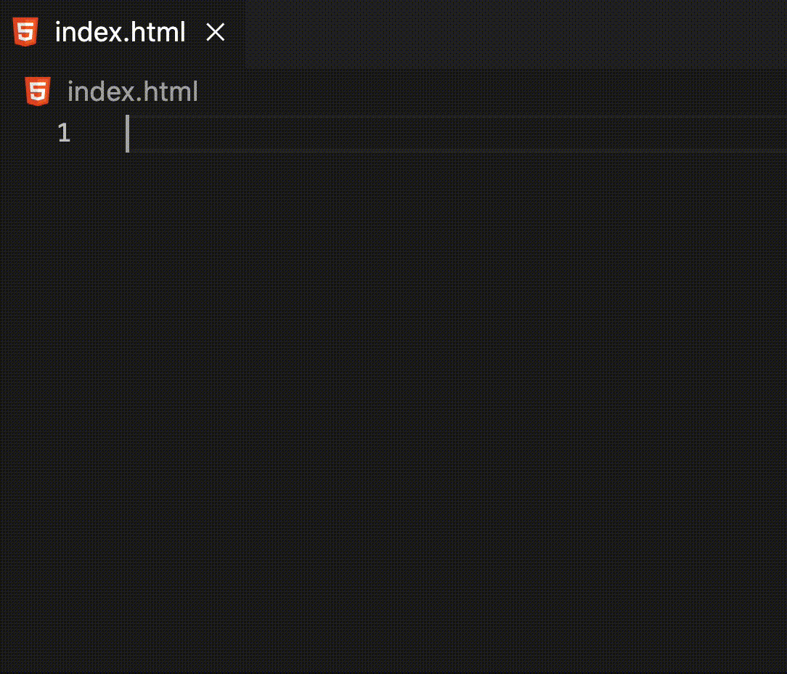

# Starting a React Application

---

## React - Where to start

Fundamentally, react has three parts:

1. one basic HTML file
2. downloaded react packages
3. javascript files that inject HTML elements

---

## 1. The HTML file

- Web pages are built in HTML

- react does not break this rule

- What does a react HTML file look like?

---

## 1. The HTML file

```html
<!DOCTYPE html>
<html lang="en">
<head>
	<meta charset="UTF-8">
	<meta http-equiv="X-UA-Compatible" content="IE=edge">
	<meta name="viewport" content="width=device-width, initial-scale=1.0">
	<title>My React App</title>
</head>
<body>
	<div id="root"></div>
</body>
</html>
```

- It is rather empty...

- The `body` only contains one element

- That `div` of id "root" is where *virtually* all the injections will happen

---

## 1. The HTML file

Making the HTML file is very easy in vs code:



---

## 1. The HTML file

- We place this `index.html` file in a folder named "public"

- This will serve as the entry point for the react application when it is loaded in a browser

```text
Our application structure now looks like:

root_folder
├── public
│   └── index.html

```
---

## 2. Download the react packages

- In every project that involves packages, you will find a `package.json` file

- This will look something like this:

```json
{
    "name": "example",
    "version": "1.0.0",
    "main": "index.js",
    "license": "MIT",
    "dependencies": {
        "react": "^16.8.6",
    }
}
```

---

## 2. Download the react packages

To create a `package.json` file:

1. Open your terminal (in the root folder)

2. Enter the command `yarn init`

3. Mash enter through the questions (you can edit or add these fields later anyway)

---

## 2. Download the react packages

At minimum, react needs three packages to function:

1. "react"
2. "react-dom"
3. "react-scripts"

---

## 2.1 "react"

- The "react" package contains the core library of react functionality

- It is what allows us to build components

- It is what will keep the DOM updated with the application's state

- It does a lot for us.

---

## 2.2 "react-dom"

- The "react-dom" package provides a method to render components into the browser's DOM

- react actually makes a virtual DOM, "react-dom" allows that virtual DOM to appear in a browser

- "react-dom" also handles the interpretation of DOM events in react

---

## 2.3 "react-scripts"

- As the name implies, the "react-scripts" package contains a set of scripts

- These scripts can be used for many tasks from testing to readying react for deployment

- For now, the most important script will be the "start" command, which is what will begin our react environment

---

## 2. Download the react packages

To download these packages:

1. Open your terminal (in the root folder)

2. Enter the command `yarn add react react-dom react-scripts`

- Note that you could also add these one at a time, ex: `yarn add react;` `yarn add react-dom;` ...

- This will take some time, as this will download both these packages and their dependancies, as well as install them.

```text
Our application structure now looks like:

root_folder
├── public
│   └── index.html
└── package.json
```

---

## 3. javascript files that inject HTML elements

- For now, we're only going to work in one javascript file

- We will name it `index.js`

- By convention, we place this file in a folder named "src" (short for source)

- What gets placed in this file?

---

## 3. javascript files that inject HTML elements

- This part is going to look more foreign than the rest, because we're going to use methods of code we didn't write:

```js
import ReactDOM from 'react-dom/client';

const root = ReactDOM.createRoot(document.getElementById("root"));

root.render( "Hello World" );
```

- `ReactDOM` comes from the "react-dom" package

- `ReactDOM` has a method called `createRoot` which expects a pointer to an HTML element as an argument

- `createRoot` returns a "root object" that can inject nodes into the DOM

- The "root object" method we call is `render`.  This places the argument we pass it into the HTML element it is bound to (in the above case it places the text node "Hello World" into the `<div id="root"></div>` which exists in the `index.html` file)

- You can read the official documentation on `createRoot` [here](https://react.dev/reference/react-dom/client/createRoot)

---

## 3. javascript files that inject HTML elements

```js
import ReactDOM from 'react-dom/client';

const root = ReactDOM.createRoot(document.getElementById("root"));

root.render( "Hello World" );
```

All together, the above js file will modify the DOM's HTML into:

```html
<!DOCTYPE html>
<html lang="en">
<head>
	<meta charset="UTF-8">
	<meta http-equiv="X-UA-Compatible" content="IE=edge">
	<meta name="viewport" content="width=device-width, initial-scale=1.0">
	<title>My React App</title>
</head>
<body>
	<div id="root">
		Hello World
	</div>
</body>
</html>
```

---

## Almost done!

```text
Our application structure now looks like:

root_folder
├── public
│   └── index.html
├── src
│   └── index.js
└── package.json
```

---

## The final piece

- We need a way to execute this `index.js` file...

- We will do this using the "react-script start"

- The "start" script will whir up the react environment for us and execute the `index.js` file after the HTML has loaded

---

## The final piece

To accomplish this we will manually edit the `package.json` file and add a "scripts" field

```json
{
  "name": "example",
  "version": "1.0.0",
  "main": "index.js",
  "dependencies": {
    "react": "^18.2.0",
    "react-dom": "^18.2.0",
    "react-scripts": "^5.0.1"
  },
  "scripts": {
    "start": "react-scripts start"
  }
}
```

Note that json files are very picky about formatting.  Make sure you use double quotes around strings, and do not trail the final value inside an object with a comma

---

## The finish line

To make use of this script:

1. Open your terminal (in the root folder)

2. Enter the command `yarn start`

3. On your first execution, agree to add the defaults to your `package.json`

4. vs code should open the default "http://localhost:3000/" in your browser

---

[topic-3-building-components](./topic-3-building-components.md)
