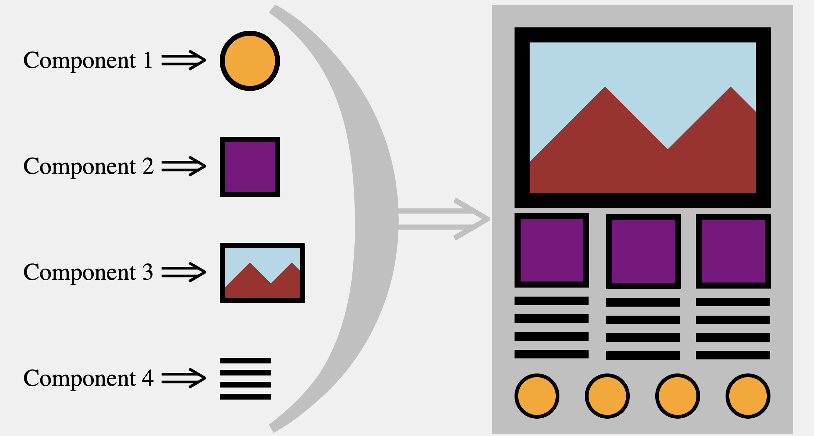

# Building Components

---

## What is a component?

- A component is a **function** that produces a small portion of the UI

- That portion of the UI could be something small:

- - a `<button>`
- - a `<p>`
- - an ``

---

## What is a component?

- A component is a **function** that produces a medium-sized portion of the UI

- That portion of the UI could be larger:

- - a grid of pictures
- - a `<nav>` of links
- - an `<aside>` of settings options

---

## What is a component?

- A component is a **function** that produces some of the UI

- More complex components will call upon other components:

- - a chat system
- - a `<canvas>` you can draw on
- - a cart of items you may never purchase

---

## What is a component?



---

## Why use components?

- **reusable** - called multiple times

- **organized** - keeps logic together

- **versatile** - can accept arguments (more on this next lecture)

---

## A brief history of components

- In 2012, react was first deployed by Facebook

- It made use of class-based components

- In 2015, functional components were introduced

- In 2019, Hooks were introduced

- Hook offer powerful and varied functionality

- Hooks only work with functional components!

- Class components are still supported

- However, react documentation recommends against building new projects using them

---

## The legacy of class components

- Good news, you're learning functional components!

- Why the history lesson?

- By convention, class definitions are named using PascalCasing

- Functional components adopted this convention as well

---

## How to build a component

### STEP 1: Make a new file

- Use PascalCase for the name of the file

- Use the `.js` extension

- yes, components are coded using javaScript!

- the name should probably relate to what portion of the UI it will create:

- - Header.js

- - LoginButton.js

- - Settings.js

---

## How to build a component

### STEP 2: Create a function

- Use PascalCase again

- Match the file name (not a hard set rule)

```jsx
// in file WelcomeToReact.js

const WelcomeToReact = () => {
	// not quite done
}
```

---

## How to build a component

### STEP 3: Make it return some portion of the UI

- Make it return HTML...

```jsx
// in file WelcomeToReact.js

const WelcomeToReact = () => {

	return <p> Welcome to react! </p>

}
```

---

## What does a component return?

- React functional components return **JSX**

- JSX = JavaScript Syntax Extension || JavaScript XML

- XML = Extensible Markup Language

- It is a combination of js and HTML

- We will learn more about JSX in topic 5 (after the check in)

---

## What does a component return?

```jsx
// in file WelcomeToReact.js

const WelcomeToReact = () => {
	// until we hit the return, we can use js as usual

	const someVariable = "Bimmy"

	console.log(someVariable)

	// this function returns JSX
	return <p> Welcome to react! </p>
}
```

---

## What does a component return?

- Remember, a function can only return one expression.

```js
const brokenFunction = () => {
	const a = 42;
	const b = "This isn't going to work";
	return a, b
}
```

---

## What does a component return?

- When we use a component that looks like this

```jsx
const BrokenHelloWorld = () => {
	return (
		<span> Hello </span>
		<span> World </span>
	)
}

```
- We will see the following error in the browser's console:

`Adjacent JSX elements must be wrapped in an enclosing tag.`

- So how do we make a component return two HTML elements?

---

## How to build a component

### STEP 4 - return **ONE** element

- For now, wrap returns in a `<div>`

```jsx
const MyList = () => {
	return (
		<div>
			<h2> MyList returns one wrapping element </h2>
			<p> But it contains many descendant elements </p>
			<ol>
				<li> Water </li>
				<li> Earth </li>
				<li> Fire </li>
				<li> Air </li>
			</ol>
		</div>
	)
}
```

---

## How to build a component

### STEP 5 - export the function

```js
const HelloWorld = () => {
	return (
		<div>
			<span> Hello <span>
			<span> World </span>
		</div>
	)
}

export default HelloWorld

```

- What is this `export default`?

- We'll learn about that in the next topic

---

## How to build a component recap

1. Make a new `js` file

2. Create a PascalCased function

3. Make it return JSX

4. return one node

5. export default

---

### Make a component that produces the following HTML:

```html
<div>
	<p>I will be produced by a component</p>
	<a href="https://www.concordiabootcamps.ca/web-development">Web Dev Bootcamp</a>
</div>
```

Convert:

solution:
```js
// in file named MyComponent.js

const MyComponent = () => {

	return (
		<div>
			<p>I will be produced by a component</p>
			<a href="https://www.concordiabootcamps.ca/web-development">Web Dev Bootcamp</a>
		</div>
	)
}

```


---

[topic-4-components-as-modules](./topic-4-components-as-modules.md)
