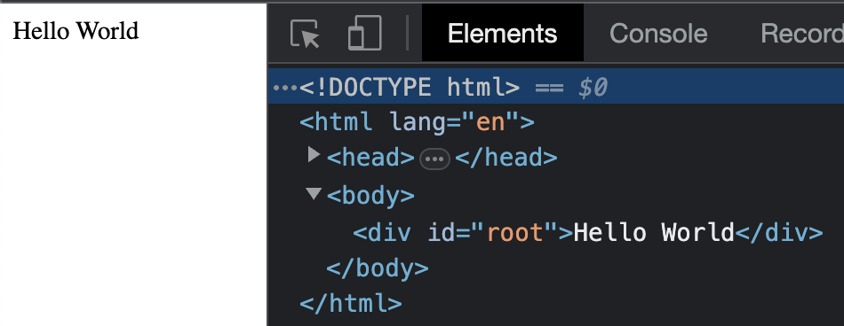
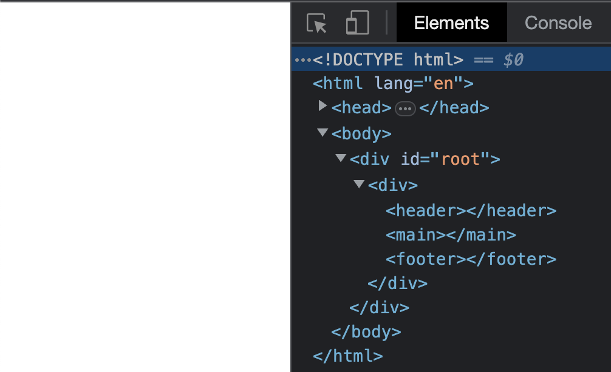

# Exercise 2: Render some HTML

**This exercise will make use of what you saw at the end of Topic 2 and the beginning of Topic 3**

---

Open up the developer tools / inspector in the browser.
Look at the "Elements" tab.



Most of this HTML is coming from `/public/index.html`, but the Text Node / content of the `<div>` of id "root" is being rendered by react.

```js
// from file /src/index.js

root.render("Hello World")

```

This web page is pretty bare.

### **STEP 1** : render a base structure of HTML

Remove the "Hello World", and instead render a `<div>`.

Inside that `<div>`, render the following (in order):
1. `<header>`
2. `<main>`
3. `<footer>`

Once you're done that, your browser should look like this:



---

### **STEP 2** : add content and more HTML into the header

There is literally no content at this point.

Add some content in the header.  You can add whatever you like, exs: "My First React Header.", "Bimmy's React Webpage"

Remember that a `<header>` is generally reserved for introductory content (or a `<nav>`), so to maintain the symantic value of HTML, it should contain a `<p>` element or `<h2`> that contains text content.

---

### **STEP 3** : add content and more HTML into the footer

Add an element and text into the `<footer>`.

---

### **STEP 4** : add content and more HTML into the footer

Add three `<section>`s into the `<main>`.

In each `<section>`, add more html and some content.

It's really up to you what you put in these sections, but here are some ideas:

- a `<ol>` of `<li>` elements of your favorite movies/books/artists
- a famous quote (Feel free to place a `<q>` element inside a `<p>` for this)
- a quirky piece of trivia

---

Once you are done, your browser should look something like this (likely with different content)


With that, exercise-2 is complete 🎉