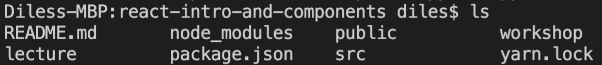

## Having difficulty with yarn install?

---

If you execute the `ls` command in your terminal, you should see the `package.json` file (as well as several folders and other files).  If you don't then your terminal isn't navigated to this repositories' root folder.

You could issue terminal commands of `cd ..` to navigate up folders or `cd <folder_name>` to navigate into folders or...

You can right click the `package.json` and select "Open in Integrated Terminal", this will open a terminal in the correct folder.

After you execute `ls` in the correct folder, it should look something like this:

