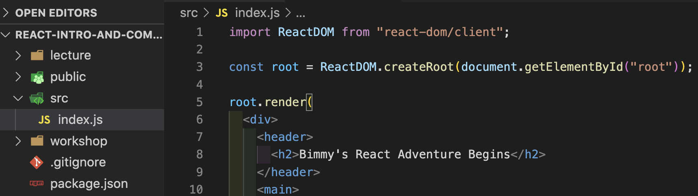
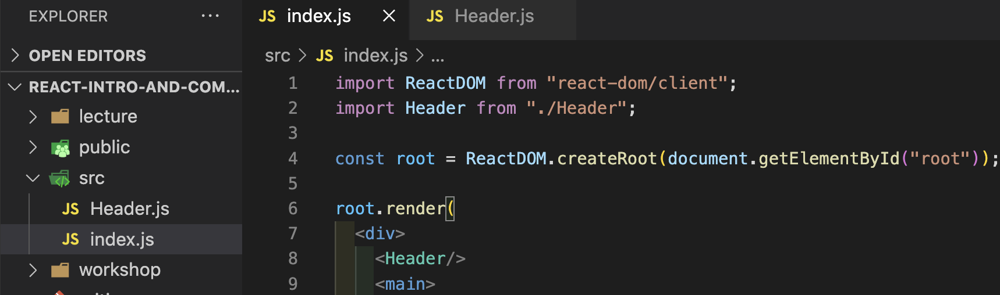

## Having difficulty using your component?

---

Before importing the component you built, your `index.js` file probably looked something like this:

---

After importing and executing your new component, your `index.js` file should look something like this:

If the return of the `Header` function is the same as the jsx it replaced, then what gets rendered into the DOM should be the same.  i.e. There will be no change in your browser.